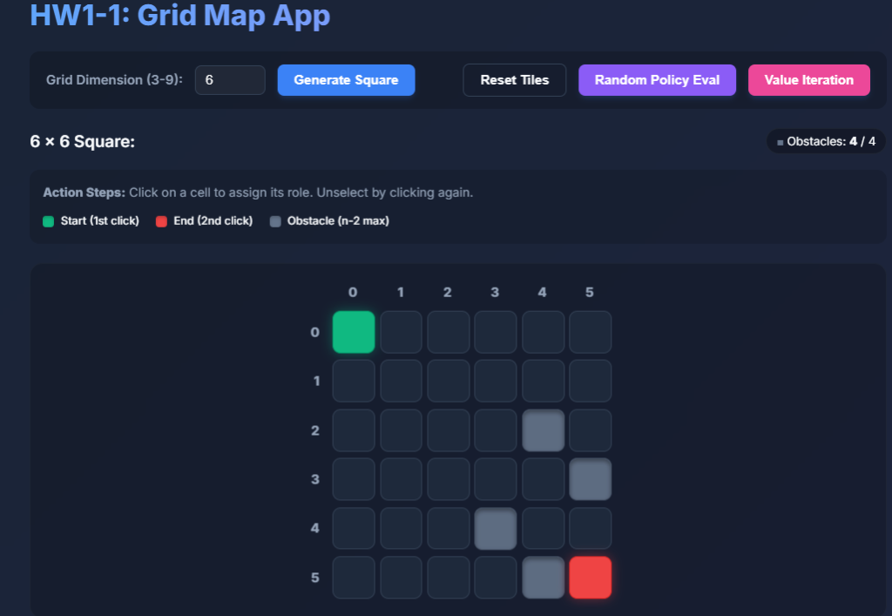
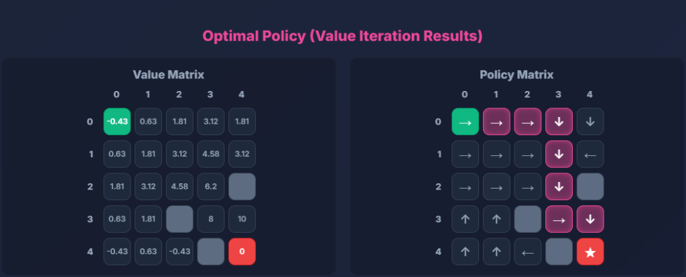

# HW1-1: Grid Map Environment & MDP Solver

這是一個基於 Flask 構建的網頁應用程式，用來視覺化與實作強化學習（Reinforcement Learning）中的**馬可夫決策過程（MDP）**。專案包含了網格地圖的建立、隨機策略評估（Policy Evaluation），以及最佳解疊代（Value Iteration）。

## 🖼️ Demo 畫面展示

<p align="center">
  
  <br>
  <em>網格地圖設定與操作介面，支援動態生成 X 軸與 Y 軸座標提示</em>
</p>

<p align="center">
  
  <br>
  <em>Value Iteration 計算結果：視覺化展示所有最小路徑（粉紫色高光），並在下方表列完整座標清單</em>
</p>

## 🌟 功能展示與階段實作 (Phases)

### 階段 1-1: 網格地圖開發 (Grid Map Development)
- **動態維度**：允許使用者輸入 `3` 到 `9` 之間的數字 $n$，動態生成大小為 $n \times n$ 的網格地圖。
- **互動式設計**：
  - **起點 (Start)**：點擊第一格顯示為**綠色**。
  - **終點 (End)**：點擊第二格顯示為**紅色**（目標狀態 `+10` Reward）。
  - **障礙物 (Obstacle)**：後續點擊之網格顯示為**灰色**，最多可設定 $n-2$ 個障礙物（撞牆或撞障礙物的 Step Penalty 為 `-1`）。
- **使用者體驗 (UX)**：具備錯誤防呆檢查（如超出數量限制的 Toast 提示）、微動畫與現代化的深色主題。網格外圍具有自動生成的 $X$ 與 $Y$ 座標軸。

### 階段 1-2: 策略顯示與價值評估 (Policy Evaluation)
- **隨機策略生成**：對每個非終端與非障礙物的狀態發布隨機的行動策略（$\uparrow, \rightarrow, \downarrow, \leftarrow$）。
- **價值函數評估 (Value Function)**：
  - 實作 **Iterative Policy Evaluation** 演算法，藉由 Bellman Equation 推導每個狀態的價值 $V(s)$。
  - **MDP 參數**：折扣參數 $\gamma = 0.9$，收斂閾值 $\theta = 10^{-4}$。
- **雙矩陣並排顯示**：按下 `Random Policy Eval` 按鈕後，會動態展開視窗並同時顯示「Value Matrix（價值矩陣）」與「Policy Matrix（策略矩陣）」。

### 階段 1-3: 價值疊代與最佳路徑 (Value Iteration & Optimal Path)
- **尋找最佳策略 (Optimal Policy)**：
  - 實作 **Value Iteration** 演算法，找出在當前環境設置下，能夠最大化 Expected Return 的行動指南。
- **最小路徑提取與多重路徑支援 (BFS Path Tracing)**：
  - 若有多條花費相同的最短路徑（受浮點數容差 $10^{-6}$ 保護），系統會擷取所有的最佳動作。
  - 運用**廣度優先搜尋 (BFS)** 找出所有避開障礙物、完美抵達終點的「所有可能最小路徑」。
- **路徑視覺化與清單**：
  - 在 Policy Matrix 畫面上，將所有最短路徑所經過的網格亮起**粉紫色高光**。
  - 畫面下方動態生成所有可能之「最短路徑清單」，並使用 $(row, col)$ 的座標格式列出，例如：`(0,0) → (0,1) → (0,2)`。

## 🚀 技術架構 (Technology Stack)

- **前端 (Frontend)**: HTML5, CSS3, Vanilla JavaScript (負責網格 DOM 渲染、動畫效果及 MDP 動態規劃矩陣邏輯)。完全 Client-Side 運行，無需後端伺服器！

## 📂 專案結構 (Directory Structure)
```
HW1-1/
├── index.html              # 唯一主程式入口，包含 HTML UI 結構、CSS 樣式與完整的 RL (Value Iteration) JS 演算法邏輯
├── README.md               # 您目前正在閱讀的專案說明文件
└── assets/                 # 存放 Demo 圖片用資料夾
```

## 🛠️ 如何執行本專案 (How to run)

因為這專案設計為 **完全前端獨立運行 (Client-side Only)**，您不再需要設定任何 Python 或伺服器環境！

1. 克隆（Clone）此專案至本地端（或直接下載 ZIP）：
   ```bash
   git clone https://github.com/Jester-99/grid-map-app.git
   cd grid-map-app
   ```
2. 直接使用任何現代瀏覽器 (Chrome, Edge, Safari...) 開啟 `index.html` 檔案即可！
   
> 💡 **提示**: 這個專案可以直接部署至 **GitHub Pages** (進入 Repo 設定 -> Pages -> 把 Branch 設為 main)，就可以獲得一個公開的專屬 Demo 網址！
